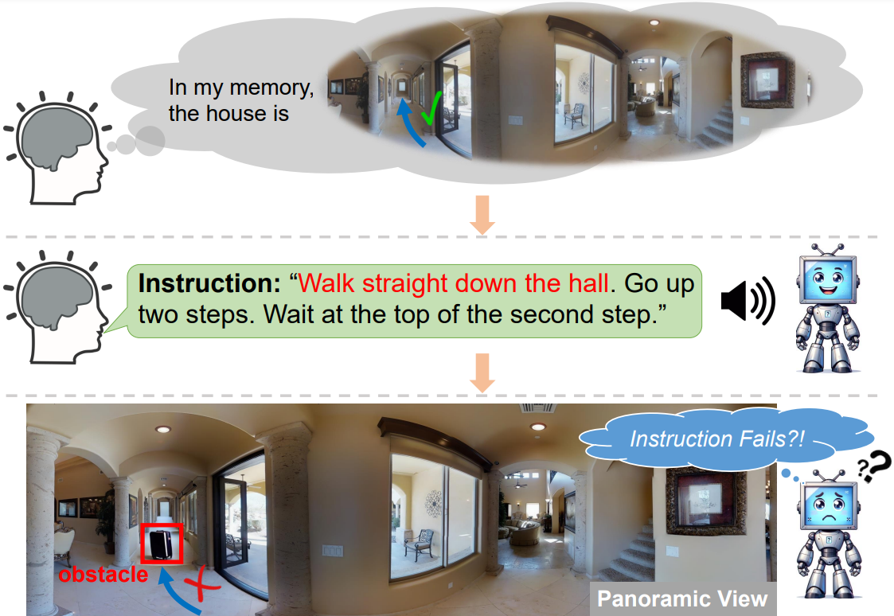

# ObstructedVLN
This repository is the official implementation of the ACM MM 2024 [paper](https://arxiv.org/abs/2407.21452) "Navigating Beyond Instructions: Vision-and-Language Navigation in Obstructed Environments".

Real-world navigation often involves dealing with unexpected obstructions such as closed doors, moved objects, and unpredictable entities. However, mainstream Vision-and-Language Navigation (VLN) tasks typically assume instructions perfectly align with the fixed and predefined navigation graphs without any obstructions. This assumption overlooks potential discrepancies in actual navigation graphs and given instructions, which can cause major failures for both indoor and outdoor agents. To address this issue, we integrate diverse obstructions into the R2R dataset by modifying both the navigation graphs and visual observations, introducing an innovative dataset and task, R2R with UNexpected Obstructions (R2R-UNO). R2R-UNO contains various types and numbers of path obstructions to generate instruction-reality mismatches for VLN research. Experiments on R2R-UNO reveal that state-of-the-art VLN methods inevitably encounter significant challenges when facing such mismatches, indicating that they rigidly follow instructions rather than navigate adaptively. Therefore, we propose a novel method called ObVLN (Obstructed VLN), which includes a curriculum training strategy and virtual graph construction to help agents effectively adapt to obstructed environments. Empirical results show that ObVLN not only maintains robust performance in unobstructed scenarios but also achieves a substantial performance advantage with unexpected obstructions.   



## Progress
- [X] Installation
- [X] Code for Generating R2R-UNO
- [X] Code for ObVLN

## Installation
1. Please follow the instructions [here](https://github.com/peteanderson80/Matterport3DSimulator#building-using-docker) to install Matterport3D Simulator.
We use the latest version instead of v0.1.
Make sure the 'import Mattersim' will not raise ImportError.

2. Setup with Anaconda and pip to install prerequisites:
```
conda create --name ObstructedVLN python==3.8
conda activate ObstructedVLN
pip install -r requirements.txt
```

## Generating R2R-UNO
```
cd R2R-UNO
```
Download the discrete views for Matterport3D from [here](https://github.com/airsplay/R2R-EnvDrop) and put it in the 'views_img' folder

### Step 0: Find redundant edges
```
python step00_block_edge.py
```
Output: `block_edge_list.json` file storing all the redundant edges for R2R paths.

### Step 1: Localize the target node
```
python step01_find_view.py
```
Output: `edge_info.json` file storing all the locations of the node pairs

### Step 2: Generate masks for inpainting
```
python step02_generate_mask.py
```
Output: `masks` folder storing all the masks

### Step 3: Inpainting
```
python step03_inpaint_pipeline.py --batch_size bs
```
Output: `all_inpaint_results` folder storing all the inpainting results for each obstruction

### Step 4: GMMs training and inference
```
python step04_gmm_selection.py
```
Output: `qualified_candidates.json` file storing all the qualified candidates

### Step 5: Final choice
```
python step05_generate_final_list.py
```
Output: 
1. `final_list.json` file storing the chosen inpainting names for each edge
2. `final_inpaint_results` folder storing the chosen inpainting results

### Step 6: View projection
```
python step06_project_views.py
```
Output: the project views in the `final_inpaint_results`

## ObVLN
We provide the code for training VLN agents for R2R and R2R-UNO here. 

### Step 0: data download
Please follow the instructions [here](https://github.com/cshizhe/VLN-DUET) to download the annotations, connectivity files, pre-trained models, and features for R2R.

### Step 1: preprocess

1. obstructed environments feature extraction

```
cd VLN-DUET/preprocess
cp ../../R2R-UNO/block_edge_list.json .
python compute_feature.py
cp inpaint_features.hdf5 ../datasets/R2R/features
```
This will generate a `inpaint_features.hdf5` file saving the extracted features by ViT-B/16

2. generate three splits for R2R-UNO paths

```
python get_block_data.py --nums=1
python get_block_data.py --nums=2
python get_block_data.py --nums=3
cp block_*_edge_list.json ../datasets/R2R/annotations
```

3. generate shortest paths for each blocked path

```
python generate_shortest_distance.py
```
This will generate a `shortest_distances` folder to save the shortest distance dictionaries of the modified graphs


### Step 2: finetuning w/o ObVLN
```
cd VLN-DUET
cd map_nav_src
bash scripts/run_r2r.sh
```
You can modify the `max_train_edge` and `max_eval_edge`in `run_r2r.sh` to choose which set of R2R-UNO to train and evaluate

### Step 3: finetuning with ObVLN
```
cd VLN-DUET
cd map_nav_src_obvln
bash scripts/run_r2r.sh
```
Also modify the `max_train_edge` and `max_eval_edge` in `run_r2r.sh`

## Citation

If you find this work helpful, please consider citing:

```bibtex
@article{hong2024navigating,
  title={Navigating Beyond Instructions: Vision-and-Language Navigation in Obstructed Environments},
  author={Hong, Haodong and Wang, Sen and Huang, Zi and Wu, Qi and Liu, Jiajun},
  journal={arXiv preprint arXiv:2407.21452},
  year={2024}
}
```
